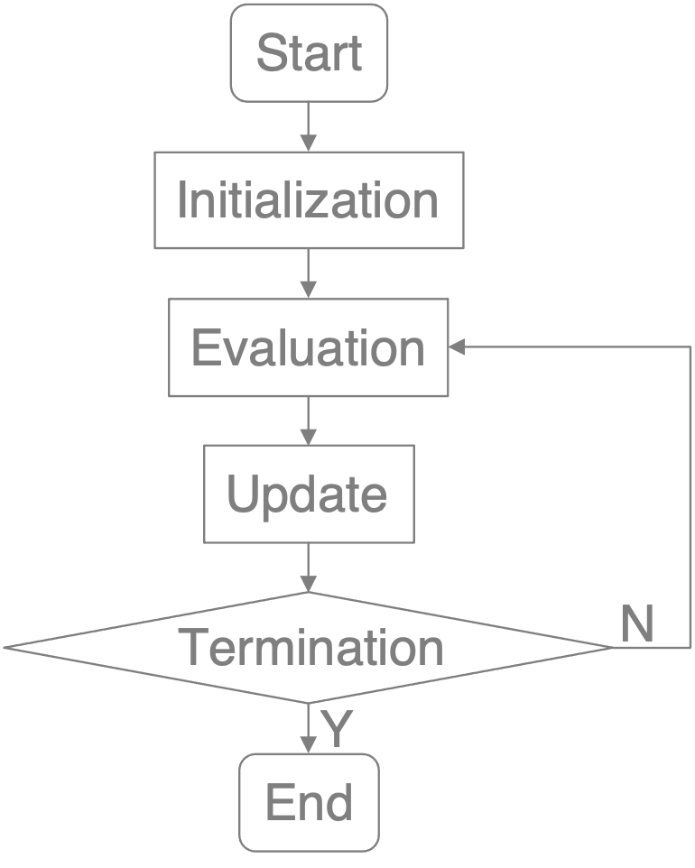

# PSO_Mathematical_optimization

## Mathematical Optimization

##### Mathematical optimization or mathematical programming is the selection of the best element(s), with regard to some criterion, from some set of available alternatives. Mainly research to maximize or minimize a specific function or variable under specific circumstances. In mathematics, maximum value and minimum value (collectively called extreme value) refers to the value of the function at the point where the function achieves the maximum (or minimum) value in a domain. The point (the abscissa) at which the function takes the extreme value is called the extreme point.

### Problem Definition

* Given
  * Objective function: absolute value function  
    `|x| = x if x is positive`  
    `|x| = −x if x is negative (in which case −x is positive)`  
    `|0| = 0`
  * Domain(s): [-100, 100]
  * Maximum or minimum: minimum

* Find
  * Extreme point

* Best known solution
  * Extreme point = 0.0
  * Fitness = 0.0

---

## Program

* main.cpp

### Argument

* ROUND: number of round
* GENERATION: number of generation
* POPULATION: number of population
* DIMENSION: there are several inputs
* MAX_POSITION: take a few at most
* MIN_POSITION: take at least a few
* MAX_VELOCITY: the maximum velocity
* MIN_VELOCITY: the minimum velocity
* w: weight of inertia
* c1: weight of particle best
* c2: weight of globel best

### Result

 * output.txt

### Encoding
```
/* Each bird has the following data */
long double position;
long double lastVelocity;
long double pBestPosition;
long double fitness;
```

---

## Particle Swarm Optimization (PSO)

##### In computational science, particle swarm optimization (PSO) is a computational method that optimizes a problem by iteratively trying to improve a candidate solution with regard to a given measure of quality. It solves a problem by having a population of candidate solutions, here dubbed particles, and moving these particles around in the search-space according to simple mathematical formula over the particle's position and velocity. Each particle's movement is influenced by its local best known position, but is also guided toward the best known positions in the search-space, which are updated as better positions are found by other particles. This is expected to move the swarm toward the best solutions.

### FlowChart



#### Initialization

```
/* For each bird */
long double position = random[MIN_POSITION, MAX_POSITION];
long double pBestPosition = position;
long double lastVelocity = random[MIN_VELOCITY, MAX_VELOCITY];
long double fitness = INT_MAX;
```

#### Evaluation

```
if (position > MAX_POSITION) {
    position = MAX_POSITION;
} else if (position < MIN_POSITION) {
    position = MIN_POSITION;
}

fitness = (long double) abs(position);
```

#### Update

```
/* Update particle best and globe best */
If fitness < pBestFitness:  
    pBestFitness = fitness;
IF pBestFitness < gBestFitness:  
    gBestFitness = pBestFitness;
    
/* Update velocity */
velocity = w * lastVelocity +
          c1 * random(0, 1) * (pBestPosition - position) +
          c2 * random(0, 1) * (gBestPosition - position);

if (velocity > MAX_VELOCITY) {
    velocity = MAX_VELOCITY;
}

if (velocity < MIN_VELOCITY) {
    velocity = MIN_VELOCITY;
}

/* Update position*/
position += velocity;
```
